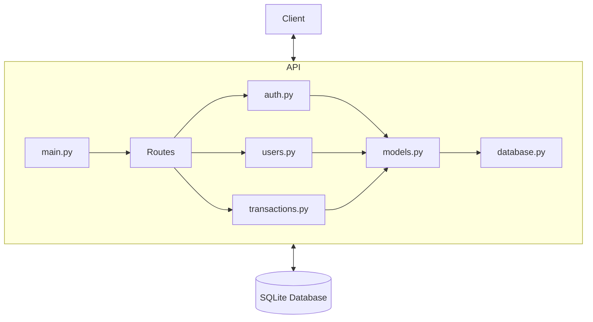

# FastAPI SQLite API Implementation

## Project Overview

This project implements a financial tracking API that allows users to:
- Register and login
- Manage their profile and balance
- Create, retrieve, and delete transactions
- Tag transactions for better organization

## Technical Architecture



## Project Structure

```
src/
├── ai_worthy_api_roo_1/
│   ├── __init__.py
│   ├── main.py              # FastAPI application entry point
│   ├── database/
│   │   ├── __init__.py
│   │   ├── models.py        # SQLAlchemy models
│   │   └── database.py      # Database connection setup
│   ├── api/
│   │   ├── __init__.py
│   │   ├── auth.py          # Auth routes
│   │   ├── users.py         # User routes
│   │   └── transactions.py  # Transaction routes
│   ├── schemas/
│   │   ├── __init__.py
│   │   ├── auth.py          # Auth schemas
│   │   ├── user.py          # User schemas 
│   │   └── transaction.py   # Transaction schemas
│   ├── core/
│   │   ├── __init__.py
│   │   ├── config.py        # Application configuration
│   │   └── security.py      # Auth utilities (password hashing, etc.)
│   └── middleware/
       ├── __init__.py
       └── auth.py           # Authentication middleware
```

## Database Models

We'll implement three tables as described in the SQL schema:

1. **Users**
   - Primary fields: id, username, password, image, balance, primary_currency
   - Relationships: One-to-many with Transactions

2. **Transactions**
   - Primary fields: id, description, currency, amount, is_income, created_at, owner_id
   - Relationships: Many-to-one with Users, One-to-many with Tags

3. **Tags**
   - Primary fields: id, text, user_id, transaction_id
   - Relationships: Many-to-one with Users and Transactions

## API Endpoints

### Auth Router
- `POST /auth/login`: Authenticate a user
- `POST /auth/register`: Register a new user

### Users Router
- `GET /users/me`: Get current user profile
- `GET /users/balance`: Get current user balance

### Transactions Router
- `GET /transactions/{id}`: Get a single transaction
- `DELETE /transactions/{id}`: Delete a transaction
- `GET /transactions/`: Get a paginated list of transactions with optional filters
- `GET /transactions/recent`: Get recent transactions
- `POST /transactions/`: Create a new transaction

## Technical Considerations

1. **Data Storage**
   - We'll use SQLAlchemy with SQLite for database operations
   - Amount values will be stored as integers (cents) to avoid floating-point issues

2. **Authentication**
   - We'll use JWT tokens for authentication
   - Password hashing with Bcrypt for security

3. **API Design**
   - We'll use Pydantic models for request/response validation
   - Proper error handling and status codes