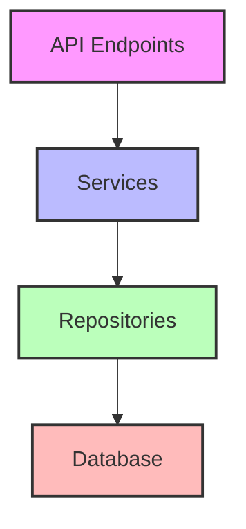
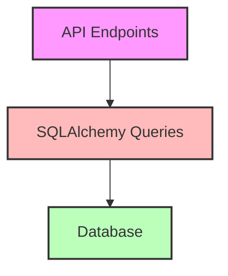
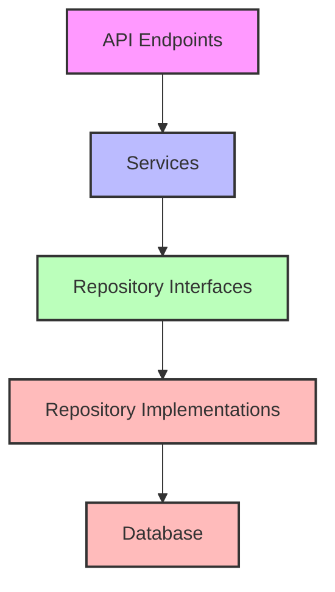
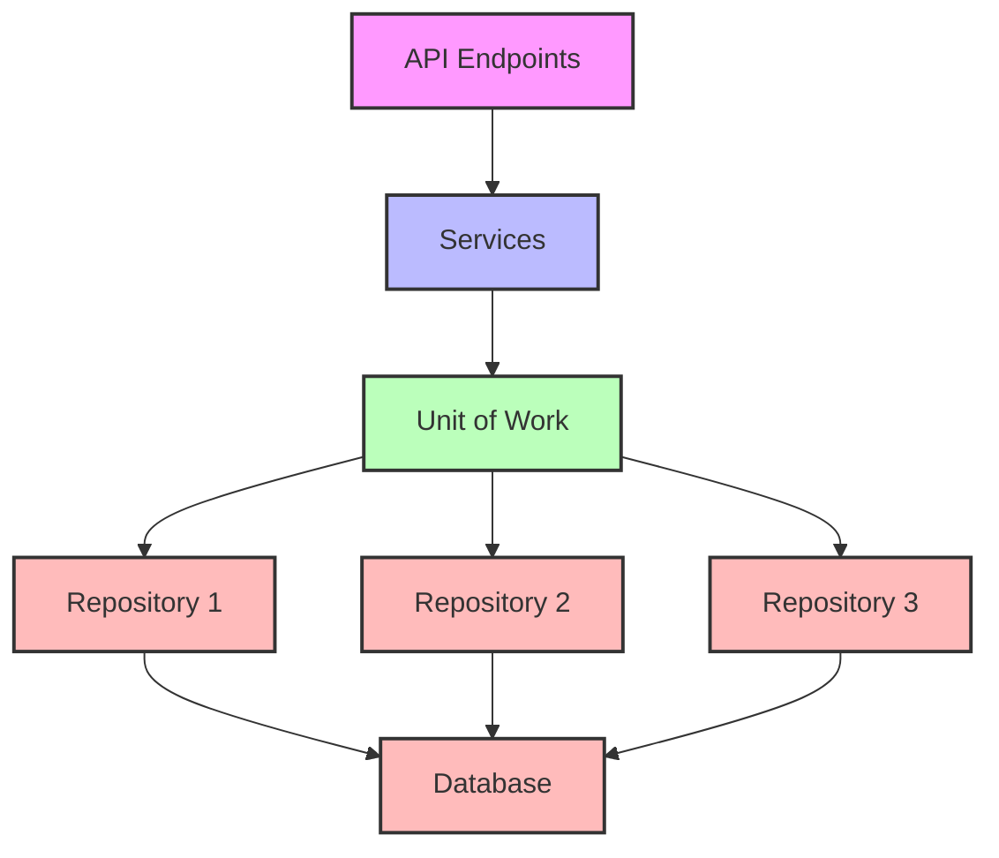
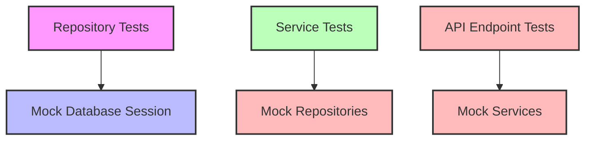

# Repository Pattern Implementation Plan

## 1. Overview

This plan outlines the steps to refactor the current Financial Tracking API to implement the Repository Pattern. The Repository Pattern provides an abstraction layer between the business logic and data access layers, making the application more maintainable, testable, and adaptable to future database changes.



## 2. Current Architecture Analysis

### Current Data Access Pattern

Currently, the application directly accesses the database from API endpoints:



### Issues with Current Approach

1. **Tight Coupling**: API endpoints are tightly coupled with database operations
2. **Code Duplication**: Similar database operations are repeated across endpoints
3. **Testing Difficulty**: Direct database access makes unit testing challenging
4. **Database Dependency**: Switching database providers would require changes throughout the codebase

## 3. Target Architecture

### Repository Pattern Implementation



### Benefits of New Architecture

1. **Loose Coupling**: API endpoints will depend on abstractions, not concrete implementations
2. **Code Reusability**: Common database operations will be centralized in repositories
3. **Improved Testability**: Repositories can be mocked for unit testing
4. **Database Flexibility**: Switching database providers will only require new repository implementations

## 4. Implementation Plan

### 4.1 Create Repository Interfaces

Define clear interfaces for each repository using Python's Protocol classes:

```python
from typing import List, Optional, Protocol
from sqlalchemy.ext.asyncio import AsyncSession

class UserRepositoryProtocol(Protocol):
    async def get_by_id(self, user_id: int) -> Optional[User]:
        ...
    
    async def get_by_username(self, username: str) -> Optional[User]:
        ...
    
    async def create(self, user_data: UserCreate) -> User:
        ...
    
    # Additional methods as needed
```

### 4.2 Implement Repository Classes

Create concrete implementations of the repository interfaces:

```python
class SQLAlchemyUserRepository:
    def __init__(self, db_session: AsyncSession):
        self.db_session = db_session
    
    async def get_by_id(self, user_id: int) -> Optional[User]:
        result = await self.db_session.execute(
            select(User).where(User.id == user_id)
        )
        return result.scalars().first()
    
    # Implement other methods
```

### 4.3 Create Service Layer

Implement service classes that use repositories to perform business logic:

```python
class UserService:
    def __init__(self, user_repository: UserRepositoryProtocol):
        self.user_repository = user_repository
    
    async def authenticate_user(self, username: str, password: str) -> Optional[User]:
        user = await self.user_repository.get_by_username(username)
        if not user or not verify_password(password, user.password):
            return None
        return user
    
    # Additional methods
```

### 4.4 Set Up Dependency Injection

Configure FastAPI's dependency injection system to provide repositories and services:

```python
def get_user_repository(db: AsyncSession = Depends(get_db)) -> UserRepositoryProtocol:
    return SQLAlchemyUserRepository(db)

def get_user_service(
    user_repository: UserRepositoryProtocol = Depends(get_user_repository)
) -> UserService:
    return UserService(user_repository)
```

### 4.5 Refactor API Endpoints

Update API endpoints to use services instead of direct database access:

```python
@router.post("/login", response_model=UserOut)
async def login(
    login_data: UserLogin,
    user_service: UserService = Depends(get_user_service)
) -> Any:
    user = await user_service.authenticate_user(
        login_data.username, login_data.password
    )
    if not user:
        raise HTTPException(
            status_code=status.HTTP_401_UNAUTHORIZED,
            detail="Invalid credentials",
        )
    return user
```

### 4.6 Implement Unit Tests

Create comprehensive unit tests for repositories and services:

```python
async def test_user_repository_get_by_username():
    # Arrange
    mock_db = AsyncMock()
    mock_db.execute.return_value.scalars.return_value.first.return_value = User(
        id=1, username="testuser", password="hashed_password"
    )
    repository = SQLAlchemyUserRepository(mock_db)
    
    # Act
    user = await repository.get_by_username("testuser")
    
    # Assert
    assert user is not None
    assert user.username == "testuser"
    mock_db.execute.assert_called_once()
```

## 5. Detailed Implementation Steps

### 5.1 Directory Structure

Create a new directory structure to accommodate the repository pattern:

```
src/ai_worthy_api_roo_1/
├── repositories/
│   ├── __init__.py
│   ├── base.py
│   ├── user_repository.py
│   ├── transaction_repository.py
│   └── tag_repository.py
├── services/
│   ├── __init__.py
│   ├── user_service.py
│   ├── transaction_service.py
│   └── auth_service.py
└── ...
```

### 5.2 Repository Interfaces and Implementations

For each entity (User, Transaction, Tag), create:
1. Repository interface (Protocol)
2. SQLAlchemy implementation

### 5.3 Service Layer Implementation

For each domain area, create service classes that:
1. Depend on repository interfaces
2. Implement business logic
3. Handle transactions and coordination between repositories

### 5.4 Dependency Injection Setup

Configure FastAPI's dependency injection to:
1. Provide repository implementations
2. Provide service instances
3. Maintain proper dependency chain

### 5.5 API Endpoint Refactoring

Update all API endpoints to:
1. Depend on services instead of direct database access
2. Remove all SQLAlchemy queries
3. Delegate business logic to services

### 5.6 Unit Testing

Implement comprehensive unit tests for:
1. Repository implementations
2. Service classes
3. API endpoints with mocked services

## 6. Handling Transactions Across Multiple Repositories

### 6.1 Unit of Work Pattern

To handle transactions that span multiple repositories, we'll implement the Unit of Work pattern alongside the Repository pattern. The Unit of Work pattern provides a way to coordinate operations across multiple repositories and ensure they all succeed or fail together.



### 6.2 Unit of Work Interface

```python
from typing import Protocol, AsyncContextManager
from sqlalchemy.ext.asyncio import AsyncSession

class UnitOfWorkProtocol(Protocol):
    user_repository: UserRepositoryProtocol
    transaction_repository: TransactionRepositoryProtocol
    tag_repository: TagRepositoryProtocol
    
    async def __aenter__(self) -> 'UnitOfWorkProtocol':
        ...
    
    async def __aexit__(self, exc_type, exc_val, exc_tb) -> None:
        ...
    
    async def commit(self) -> None:
        ...
    
    async def rollback(self) -> None:
        ...
```

### 6.3 SQLAlchemy Implementation

```python
class SQLAlchemyUnitOfWork:
    def __init__(self, session_factory):
        self.session_factory = session_factory
        
    async def __aenter__(self):
        self.session = self.session_factory()
        self.user_repository = SQLAlchemyUserRepository(self.session)
        self.transaction_repository = SQLAlchemyTransactionRepository(self.session)
        self.tag_repository = SQLAlchemyTagRepository(self.session)
        return self
        
    async def __aexit__(self, exc_type, exc_val, exc_tb):
        try:
            if exc_type:
                await self.rollback()
            else:
                await self.commit()
        finally:
            await self.session.close()
            
    async def commit(self):
        await self.session.commit()
        
    async def rollback(self):
        await self.session.rollback()
```

### 6.4 Dependency Injection Setup

```python
def get_unit_of_work() -> UnitOfWorkProtocol:
    return SQLAlchemyUnitOfWork(async_session)
```

### 6.5 Service Implementation with Unit of Work

```python
class TransactionService:
    def __init__(self, unit_of_work: UnitOfWorkProtocol):
        self.unit_of_work = unit_of_work
        
    async def create_transaction(self, transaction_data: TransactionCreate, user_id: int) -> Transaction:
        async with self.unit_of_work as uow:
            # Create transaction
            new_transaction = await uow.transaction_repository.create(
                transaction_data, user_id
            )
            
            # Update user balance
            user = await uow.user_repository.get_by_id(user_id)
            if not user:
                raise ValueError("User not found")
                
            formatted_amount = int(transaction_data.amount * 100)
            if transaction_data.is_income:
                new_balance = user.balance + formatted_amount
            else:
                new_balance = user.balance - formatted_amount
                
            await uow.user_repository.update_balance(user_id, new_balance)
            
            # Create tags if provided
            if transaction_data.tags:
                for tag_text in transaction_data.tags:
                    await uow.tag_repository.create(
                        tag_text, user_id, new_transaction.id
                    )
            
            # The commit is handled by the unit of work's __aexit__ method
            return new_transaction
```

### 6.6 API Endpoint Using Service with Unit of Work

```python
@router.post("/", response_model=bool)
async def create_transaction(
    transaction_data: TransactionCreate,
    current_user: User = Depends(get_current_user),
    transaction_service: TransactionService = Depends(get_transaction_service)
) -> Any:
    """
    Create a new transaction.
    
    Args:
        transaction_data: Transaction information.
        current_user: The authenticated user.
        transaction_service: Transaction service.
        
    Returns:
        True if transaction was created successfully.
    """
    await transaction_service.create_transaction(transaction_data, current_user.id)
    return True
```

### 6.7 Real-World Example: Creating a Transaction

```python
# Repository interfaces
class TransactionRepositoryProtocol(Protocol):
    async def create(self, transaction_data: TransactionCreate, user_id: int) -> Transaction:
        ...
    
    async def get_by_id(self, transaction_id: int, user_id: int) -> Optional[Transaction]:
        ...
    
    # Other methods...

class UserRepositoryProtocol(Protocol):
    async def get_by_id(self, user_id: int) -> Optional[User]:
        ...
    
    async def update_balance(self, user_id: int, new_balance: int) -> None:
        ...
    
    # Other methods...

class TagRepositoryProtocol(Protocol):
    async def create(self, tag_text: str, user_id: int, transaction_id: int) -> Tag:
        ...
    
    # Other methods...

# Repository implementations
class SQLAlchemyTransactionRepository:
    def __init__(self, session: AsyncSession):
        self.session = session
    
    async def create(self, transaction_data: TransactionCreate, user_id: int) -> Transaction:
        formatted_amount = int(transaction_data.amount * 100)
        
        new_transaction = Transaction(
            description=transaction_data.description,
            currency=transaction_data.currency,
            amount=formatted_amount,
            is_income=transaction_data.is_income,
            owner_id=user_id
        )
        
        self.session.add(new_transaction)
        await self.session.flush()  # Flush to get the ID
        
        return new_transaction

class SQLAlchemyUserRepository:
    def __init__(self, session: AsyncSession):
        self.session = session
    
    async def get_by_id(self, user_id: int) -> Optional[User]:
        result = await self.session.execute(
            select(User).where(User.id == user_id)
        )
        return result.scalars().first()
    
    async def update_balance(self, user_id: int, new_balance: int) -> None:
        await self.session.execute(
            update(User)
            .where(User.id == user_id)
            .values(balance=new_balance)
        )

class SQLAlchemyTagRepository:
    def __init__(self, session: AsyncSession):
        self.session = session
    
    async def create(self, tag_text: str, user_id: int, transaction_id: int) -> Tag:
        new_tag = Tag(
            text=tag_text,
            user_id=user_id,
            transaction_id=transaction_id
        )
        
        self.session.add(new_tag)
        await self.session.flush()
        
        return new_tag

# Service implementation
class TransactionService:
    def __init__(self, unit_of_work: UnitOfWorkProtocol):
        self.unit_of_work = unit_of_work
    
    async def create_transaction(self, transaction_data: TransactionCreate, user_id: int) -> Transaction:
        async with self.unit_of_work as uow:
            # Get user to check if exists and get current balance
            user = await uow.user_repository.get_by_id(user_id)
            if not user:
                raise ValueError("User not found")
            
            # Create transaction
            new_transaction = await uow.transaction_repository.create(
                transaction_data, user_id
            )
            
            # Update user balance
            formatted_amount = int(transaction_data.amount * 100)
            if transaction_data.is_income:
                new_balance = user.balance + formatted_amount
            else:
                new_balance = user.balance - formatted_amount
            
            await uow.user_repository.update_balance(user_id, new_balance)
            
            # Create tags if provided
            if transaction_data.tags:
                for tag_text in transaction_data.tags:
                    await uow.tag_repository.create(
                        tag_text, user_id, new_transaction.id
                    )
            
            return new_transaction
```

## 7. Testing Strategy

### 7.1 Unit Tests



1. **Repository Tests**: Test repository implementations with mocked database sessions
2. **Service Tests**: Test service classes with mocked repositories
3. **API Tests**: Test API endpoints with mocked services

### 7.2 Integration Tests

1. Test repositories with a test database
2. Test services with real repositories and a test database
3. Test API endpoints with real services and repositories

### 7.3 Regression Tests

Ensure all existing functionality works correctly after refactoring:
1. User authentication and registration
2. Transaction creation, retrieval, and deletion
3. User balance updates
4. Tag management

## 8. Implementation Timeline

1. **Phase 1**: Create repository interfaces and implementations (2 days)
2. **Phase 2**: Implement service layer (2 days)
3. **Phase 3**: Set up dependency injection (1 day)
4. **Phase 4**: Refactor API endpoints (3 days)
5. **Phase 5**: Implement unit tests (2 days)
6. **Phase 6**: Perform regression testing (1 day)

Total estimated time: 11 days

## 9. Risks and Mitigations

| Risk | Probability | Impact | Mitigation |
|------|------------|--------|------------|
| Breaking existing functionality | Medium | High | Comprehensive regression testing |
| Performance degradation | Low | Medium | Benchmark before and after refactoring |
| Increased complexity | Medium | Low | Clear documentation and code organization |
| Transaction management issues | Medium | High | Careful handling of transaction boundaries |

## 10. Documentation Requirements

1. **Repository Interfaces**: Document clear contracts for each repository method
2. **Service Classes**: Document business logic and repository dependencies
3. **Dependency Injection**: Document how to provide and use repositories and services
4. **Usage Examples**: Provide examples of how to use repositories and services

## 11. Conclusion

Implementing the Repository Pattern will significantly improve the maintainability, testability, and flexibility of the Financial Tracking API. By creating a clear separation between business logic and data access, the application will be better prepared for future changes, including potential database provider switches.

The addition of the Unit of Work pattern ensures that operations spanning multiple repositories maintain data consistency through proper transaction management. This comprehensive approach addresses both the immediate need for better code organization and the long-term goal of database provider flexibility.