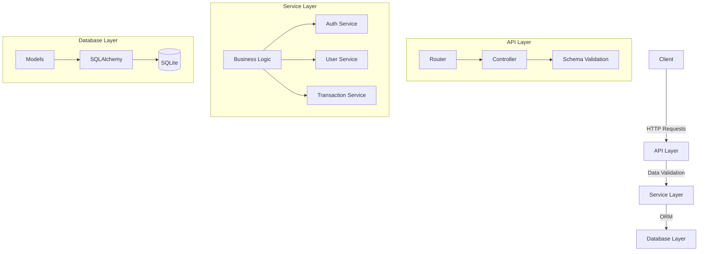

# System Patterns

## Architecture Overview

The system follows a layered architecture pattern:

## Design Patterns

### Repository Pattern
- Abstracts data access logic
- Provides a clean API for database operations
- Enables easier unit testing by allowing mocked repositories

### Dependency Injection
- FastAPI's dependency system for providing services to routes
- Enables easier testing and component replacement

### Data Transfer Objects (DTOs)
- Using Pydantic models for request and response validation
- Clear separation between API models and database models

## Security Patterns

### Password Hashing
- Bcrypt for secure password storage
- Salt rounds configured for optimal security/performance balance

### JWT Authentication
- Token-based authentication for API endpoints
- Role-based access control for protected resources

## Database Patterns

### ORM (Object-Relational Mapping)
- SQLAlchemy for database operations
- Declarative models for representing database tables

### Migrations
- Alembic for database schema migrations
- Version control for database schema changes

## API Design Patterns

### RESTful API
- Resource-based URL structure
- Appropriate HTTP methods for different operations
- Proper HTTP status codes for different scenarios

### Pagination
- Offset-based pagination for transaction listings
- Filtering capabilities for advanced queries

## Error Handling

### Exception Middleware
- Centralized error handling
- Consistent error response format

### Validation
- Pydantic models for request validation
- Detailed validation error messages